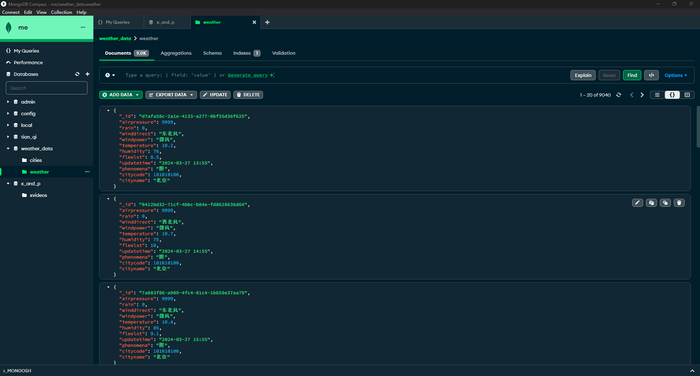
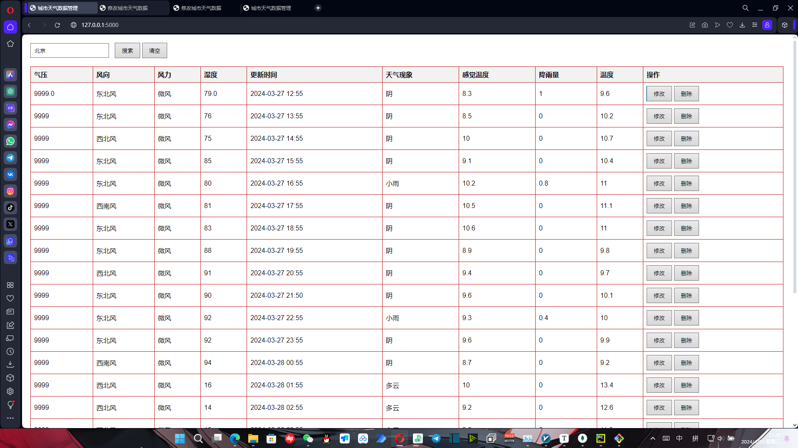
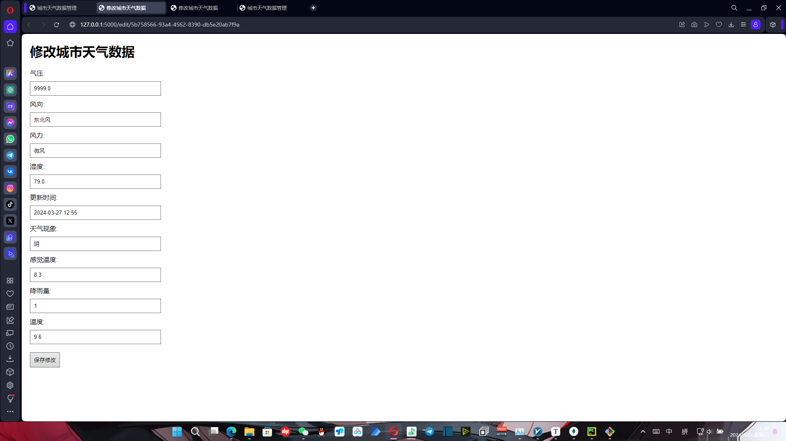
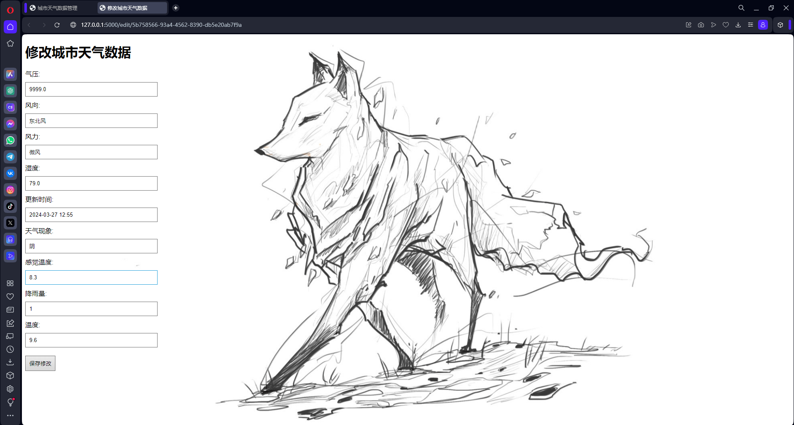

# 2024_04_22数据采集器与预处理练习
### 使用MongoDB与Flask（Python）构建前后端交互实践
## 练习需求:
1. 使用python将**all_cities_weather_data.csv**处理成**cities和weather**两个数据集合存到**weather_data**库中,
其中"cities"数据集合为表中的citycode和cityname字段,weather为其它字段;
2. 实现前后端交互,在前端可对后端数据进行查询\修改\删除操作;
## 入库数据

## 前端页面
[index.html](./static/index.png)

[edit.html](./static/edit01.png)

大片留白不好看,所以放了只狐狸🦊

